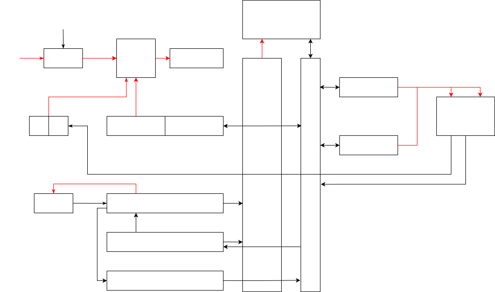

# SSPPU - Simple CPU in VHDL designed to run on Basys 3

Don't expect quality code. This is what you get if you leave a student with [Ben Eater's 8-bit computer series](https://www.youtube.com/playlist?list=PLowKtXNTBypGqImE405J2565dvjafglHU) as only previous experience and they learned VHDL by copy-pasting StackOverflow and other random examples from shady, full of ads, websites.

## Architecture

Even though it has some differences, the original architecture was inspired by [Ben Eater's 8-bit computer](https://www.youtube.com/watch?v=HyznrdDSSGM) which itself is inspired by the SAP-1 (Simple-As-Possible) architecture described in [Digital Computer Electronics by Albert Paul Malvino and Jerald A. Brown](https://archive.org/details/367026792DigitalComputerElectronicsAlbertPaulMalvinoAndJeraldABrownPdf1)

Red signals are hardcoded, black ones can be controlled by control signals.

## Demos

### Bad Apple

It plays [Bad Apple](https://en.wikipedia.org/wiki/Bad_Apple!!#Use_as_a_graphical_and_audio_test) : [Source](examples/bad_apple.ssppu) [Video (YouTube)](https://youtu.be/le3ezgEN8j0)

